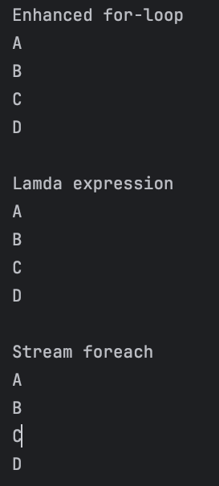
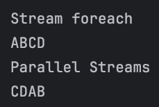

# The Difference Between Collection.stream().forEach() and Collection.forEach()

## 1. Overview
자바에서 컬렉션을 반복하는 옵션에는 여러가지가 있다.
이번 글에서는 2가지 비슷한 접근 방식을 살펴본다.

대부분 둘다 동일한 경과를 보이지만, 몇 가지 미묘한 차이점을 볼 예정이다.

## 2. Simple List
 a. 가장 간단한 방법은 향상 for문을 이용하는 것이다.
 ```java
   for(String s : list) {
     // do something with s
   }
 ```
 b. 람다식으로도 가능하다(Funtional-style)
 ```java
    Consumer<String> consumer = s -> { System.out::println };
    list.forEach(consumer);
 ```
 c. stream의 forEach()를 사용할 수 있다.
 ```java
    list.stream().forEach(consumer);
 ```

<br>

## 3. Execution Order (실행 순서)
아마 여기서 차이가 나는 것 같다.
 - Collection.foreach()의 경우 요소에 대한 처리 순서를 직접 정의한다.
 - 반면 Collection.stream().foreach()의 경우 처리 순서를 정의되지 않는다.
위의 경우 두 가지는 크게 차이가 나지 않는다.

## 3.1 Parallel Streams (병렬 스트림)
병렬 스트림을 사용하면 여러 스레드(multi thread)에서 스트림을 실행할 수 있으며 이런 상황에서는 실행 순서는 정의되지 않는다.
java는 Collectors.toList()와 같은 터미널 작업이 호출되기 전에 모든 스레드가 완료되도록 요구한다.

여기서 말하는 터미널 작업은 스트림의 처리를 끝내고 결과를 생성하는 작업을 말한다. 
즉 스트림을 소비하고, 스트림에 대한 더 이상의 작업을 허용하지 않는다.<br>
ex) list.forEach(System.out::println), list.stream().collect(Collectors.toList()), list.stream().reduce(~) 등등
<br>
<br>
아래 코드를 실행해보자
```java
list.forEach(System.out::print);
System.out.print(" ");
list.parallelStream().forEach(System.out::print);
```
<br>
코드를 여러 번 실행하면 list.forEach()가 삽입 순서대로 항목을 처리한다.
반면 list.parallelStream().forEach()는 실행될 때마다 다른 결과를 생성하는 것을 볼 수 있다

<br>
실행 결과


<br>

## 3.2 Custom Iterators
간단하게 역순으로 반복하는 Iterator를 정의해서 실행시켜 보자.

```java
class ReverseList extends ArrayList<String> {

    @Override
    public Iterator<String> iterator() {

        int startIndex = this.size() - 1;
        List<String> list = this;

        Iterator<String> it = new Iterator<String>() {

            private int currentIndex = startIndex;

            @Override
            public boolean hasNext() {
                return currentIndex >= 0;
            }

            @Override
            public String next() {
                String next = list.get(currentIndex);
                currentIndex--;
                return next;
             }

             @Override
             public void remove() {
                 throw new UnsupportedOperationException();
             }
         };
         return it;
    }
}
```

