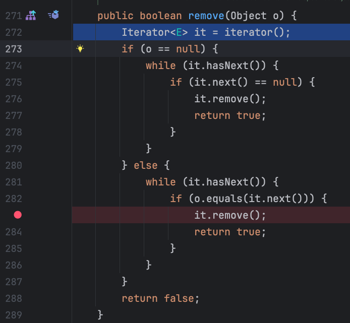
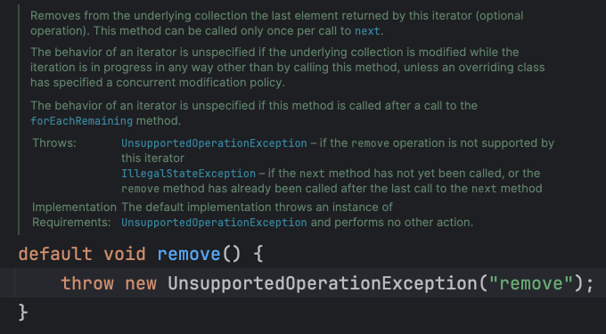
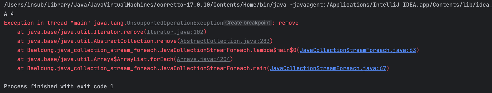
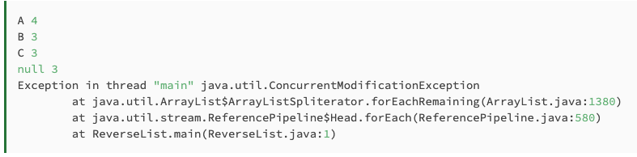
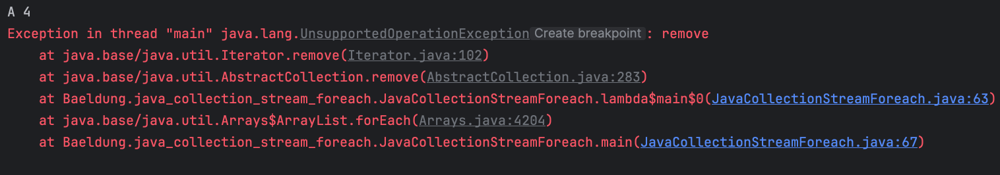
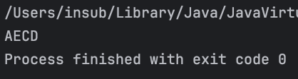

# The Difference Between Collection.stream().forEach() and Collection.forEach()

## 1. Overview
자바에서 컬렉션을 반복하는 옵션에는 여러가지가 있다.
이번 글에서는 2가지 비슷한 접근 방식을 살펴본다.

대부분 둘다 동일한 경과를 보이지만, 몇 가지 미묘한 차이점을 볼 예정이다.

## 2. Simple List
 a. 가장 간단한 방법은 향상 for문을 이용하는 것이다.
 ```java
   for(String s : list) {
     // do something with s
   }
 ```
 b. 람다식으로도 가능하다(Funtional-style)
 ```java
    Consumer<String> consumer = s -> { System.out::println };
    list.forEach(consumer);
 ```
 c. stream의 forEach()를 사용할 수 있다.
 ```java
    list.stream().forEach(consumer);
 ```

<br>

## 3. Execution Order (실행 순서)
아마 여기서 차이가 나는 것 같다.
 - Collection.foreach()의 경우 요소에 대한 처리 순서를 직접 정의한다.
 - 반면 Collection.stream().foreach()의 경우 처리 순서를 정의되지 않는다.
위의 경우 두 가지는 크게 차이가 나지 않는다.

## 3.1 Parallel Streams (병렬 스트림)
병렬 스트림을 사용하면 여러 스레드(multi thread)에서 스트림을 실행할 수 있으며 이런 상황에서는 실행 순서는 정의되지 않는다.
java는 Collectors.toList()와 같은 터미널 작업이 호출되기 전에 모든 스레드가 완료되도록 요구한다.

여기서 말하는 터미널 작업은 스트림의 처리를 끝내고 결과를 생성하는 작업을 말한다. 
즉 스트림을 소비하고, 스트림에 대한 더 이상의 작업을 허용하지 않는다.<br>
ex) list.forEach(System.out::println), list.stream().collect(Collectors.toList()), list.stream().reduce(~) 등등
<br>
<br>
아래 코드를 실행해보자
```java
list.forEach(System.out::print);
System.out.print(" ");
list.parallelStream().forEach(System.out::print);
```
<br>
코드를 여러 번 실행하면 list.forEach()가 삽입 순서대로 항목을 처리한다.
반면 list.parallelStream().forEach()는 실행될 때마다 다른 결과를 생성하는 것을 볼 수 있다

<br>
실행 결과


<br>

## 3.2 Custom Iterators
간단하게 역순으로 반복하는 Iterator를 정의해서 실행시켜 보자.

```java
class ReverseList extends ArrayList<String> {

    @Override
    public Iterator<String> iterator() {

        int startIndex = this.size() - 1;
        List<String> list = this;

        Iterator<String> it = new Iterator<String>() {

            private int currentIndex = startIndex;

            @Override
            public boolean hasNext() {
                return currentIndex >= 0;
            }

            @Override
            public String next() {
                String next = list.get(currentIndex);
                currentIndex--;
                return next;
             }

             @Override
             public void remove() {
                 throw new UnsupportedOperationException();
             }
         };
         return it;
    }
}
```
<br>
<br>

근데 Bealdung에서 Collection.forEach()에서 내부적으로 custom iterator를 사용하는 것 처럼 나와있고
<br>
예문에도 아래처럼 나와있는데 직접 돌려본 결과 아니였다.

```java
List<String> myList = new ReverseList();
myList.addAll(list);

myList.forEach(System.out::print); 
System.out.print(" "); 
myList.stream().forEach(System.out::print);
```
<br>
<br>
예상 결과

<br>
<br>
실제 결과


<br>
<br>
컴파일된 코드도 보면 iterator를 호출하고 있지 않고 Collection.forEach()와 정의한 Consumer 로직대로 출력 한다.


<br>
<br>
실제로 반대로 출력하고 싶으면, 아래처럼 <br>
- custom iterator를 직접 사용하거나
- enhanced for-loop를 사용하면 된다. (내부적으로 구현한 iterator를 사용)

```java
List<String> myList = new ReverseList();
        myList.addAll(list);

        Iterator iterator = myList.iterator();
        System.out.println("custom iterator 직접 사용");
        while(iterator.hasNext()) {
            System.out.print(iterator.next());
        }
        System.out.println();

        // 구현한 iterator를 호출해서 사용하고 있음
        System.out.println("enhanced for-loop");
        for(String s : myList) {
            System.out.print(s);
        }
        System.out.println();

        // 찾았다 범인, 컴파일러가 forEach를 컴파일 할때 iterable로 사용하는게 아니라
        // 그냥 list의 foreach문을 호출하고 있음
        // foreach함수를 보면 안에서 향상for문을 사용하고 있는데 파라미터로 넘긴 Consumer 클래스(Functional 클래스) 대로 동작
        System.out.println("그냥 forEach() 사용");
        myList.forEach(x -> System.out.print(x));
        System.out.println();

        //stream의 foreach 호출
        System.out.println("스트림 forEach() 사용");
        myList.stream().forEach(System.out::print);
```
<br>
실행 결과

<br>
<br>
전체 컴파일 코드
<br>

```java
public class JavaCollectionStreamForeach {
    public JavaCollectionStreamForeach() {
    }

    public static void main(String[] args) {
        List<String> list = Arrays.asList("A", "B", "C", "D");
        List<String> myList = new ReverseList();
        myList.addAll(list);
        Iterator iterator = myList.iterator();
        System.out.println("custom iterator 직접 사용");

        while(iterator.hasNext()) {
            System.out.print(iterator.next());
        }

        System.out.println();
        System.out.println("enhanced for-loop");
        Iterator var4 = myList.iterator();

        while(var4.hasNext()) {
            String s = (String)var4.next();
            System.out.print(s);
        }

        System.out.println();
        System.out.println("그냥 forEach() 사용");
        myList.forEach((x) -> {
            System.out.print(x);
        });
        System.out.println();
        System.out.println("스트림 forEach() 사용");
        Stream var10000 = myList.stream();
        PrintStream var10001 = System.out;
        Objects.requireNonNull(var10001);
        var10000.forEach(var10001::print);
    }
}
```
<br>
그러면서 `The reason for the different results is that forEach() used directly on the list uses the custom iterator` 라고 되어있는데
iterator가 아니라 정의한 Functional-class 대로 출력된다.

## 4. Modification of the Collection (컬렉션 수정)

대부분의 컬렉션은 반복(iterating)하는 동안에는 구조적으로 수정하면 안된다.
<br>
만약, 반복하는 동안 요소가 삭제되거나 추가되면 `ConcurrentModification exception` 이 발생한다.
<br>
게다가 컬렉션은 빠르게 실패(fast fail)되도록 설계 되어있다. 즉, 수정이 발생하면 즉시 예외가 발생한다.
<br>
마찬가지로 스트림 파이프라인 실행 중에 요소를 추가하거나 제거하면 ConcurrentModification 예외가 발생합니다. 그러나 나중에 예외가 발생합니다.

<br>

## 4.1 Removing an Element
"D"를 삭제하는 Consumer 인터페이스를 구현하고
```java
Consumer<String> removeElement = s -> {
    System.out.println(s + " " + list.size());
    if (s != null && s.equals("A")) {
        list.remove("D");
    }
};
```
- remove() 메서드는 AbstractCollection의 remove() 메서드를 호출 
- 내부에서 iterator를 통해 iterator의 remove를 제 호출한다.

<br>
<br>
iterator 인터페이스에 정의 되어있는 remove()메서드를 보면 항상 `UnsupportedOperationException` 예외를 던지게 되어있다.

<br>
<br>
실행결과

<br>
<br>
#### forEach() 메서드는 실패가 빨라서, 반복을 중지하고 다음 요소를 처리하기 전에 예외를 확인한다.
<br>

지금부터는 stream().forEach()를 살펴보자
```java
list.stream().forEach(removeElement);
```
교재에서는 돌려보면 아래 결과처럼 나온다고 한다

<br>
<br>
근데 실제로 돌려보면 아래처럼나온다...


<br>
<br>
#### stream()의 forEach()는 Collection.forEach()와 다르게 모든 요소를 확인하고 예외를 출력한다는걸 보여주고 싶은 것 같다.

## 4.2. Changing Elements
중간에 값을 바꾸는 코드를 실행해보면
```java
list.forEach(e -> {
            list.set(1, "E");
        });

        list.forEach(System.out::print);
```
실행결과

<br><br>
위 작업을 수행하는데 문제가 없다?!?!<br>
문제가 없지만 Java에서는 스트림에 대한 작업이 간섭하지 않아야 합니다.<br>
이는 스트림 파이프라인 실행 중에 요소를 수정해서는 안 된다는 의미입니다<br><br>
#### 그 이유는 스트림이 병렬 실행을 용이하게 해야 하기 때문입니다. 여기서 스트림 요소를 수정하면 예기치 않은 동작이 발생할 수 있습니다.

## 5. Conclusion
컬렉션을 반복하는 두 가지 방법만 비교하기 위한 것이라는 점에 유의하는 것이 중요합니다. 표시된 동작에 따라 정확성이 결정되는 코드를 작성해서는 안 됩니다.

스트림은 필요하지 않지만 컬렉션에 대해서만 반복하려는 경우 첫 번째 선택은 컬렉션에서 직접 forEach()를 사용하는 것입니다.
